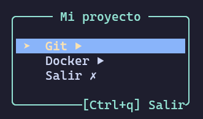
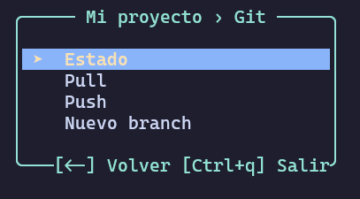
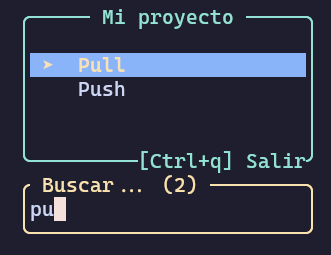
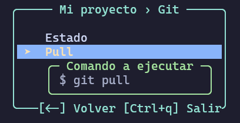
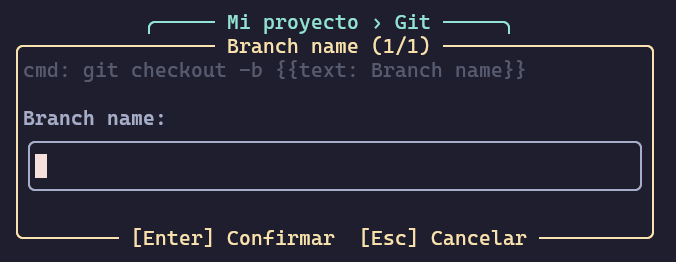
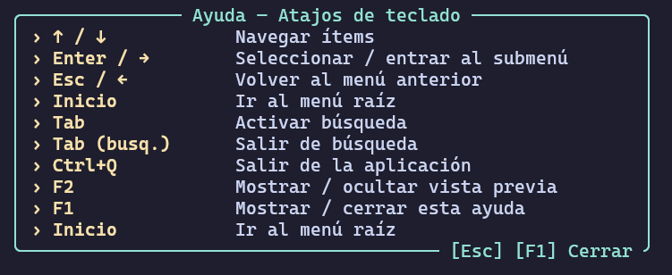

# tmenu — Tutorial de uso

`tmenu` es un lanzador de comandos interactivo para la terminal. Lee un archivo `.toon` con tu menú personalizado y te permite navegar, buscar y ejecutar comandos sin tocar el teclado más de lo necesario.

---

## Contenido

- [tmenu — Tutorial de uso](#tmenu--tutorial-de-uso)
  - [Contenido](#contenido)
  - [1. Archivo de configuración `.toon`](#1-archivo-de-configuración-toon)
  - [2. Arrancar la aplicación](#2-arrancar-la-aplicación)
  - [3. Navegar el menú](#3-navegar-el-menú)
    - [Ejemplo: seleccionar un comando](#ejemplo-seleccionar-un-comando)
  - [4. Submenús](#4-submenús)
  - [5. Búsqueda fuzzy](#5-búsqueda-fuzzy)
  - [6. Vista previa del comando](#6-vista-previa-del-comando)
  - [7. Parámetros interpolados](#7-parámetros-interpolados)
  - [8. Ayuda integrada](#8-ayuda-integrada)
  - [9. Referencia de atajos](#9-referencia-de-atajos)

---

## 1. Archivo de configuración `.toon`

Toda la estructura del menú vive en un archivo de texto plano con extensión `.toon`.

```
# Ejemplo de menú para un proyecto con comandos de Git y Docker
"Mi proyecto":
    Git:
        Estado:        "git status"
        Pull:          "git pull"
        Push:          "git push"
        "Nuevo branch":  "git checkout -b {{text: Branch name}}"
    Docker:
        Levantar:      "docker compose up -d"
        Bajar:         "docker compose down"
        Logs:          "docker compose logs -f"
    Salir: exit
```

**Reglas básicas:**

- La primera línea terminada en `:` es el **título** del menú.
- Las entradas sin valor a la derecha del `:` son **submenús**.
- Las entradas con valor son **comandos**.
- `{{text: Etiqueta}}` define un **parámetro** que se pedirá al usuario antes de ejecutar.
- `#` la línea es un comentario y se ignora.

---

## 2. Arrancar la aplicación

```bash
# Archivo por defecto (tmenu.toon en el directorio actual)
tmenu

# Archivo explícito
tmenu mi-proyecto.toon
```

Al iniciar verás el menú principal centrado en la terminal:




- `▶` indica un submenú.
- `✗` indica el ítem de salida.
- El ítem resaltado en azul/amarillo es el seleccionado.

---

## 3. Navegar el menú

| Tecla | Acción |
|-------|--------|
| `↑` / `↓` | Moverse entre ítems |
| `Enter` o `→` | Seleccionar / entrar al submenú |
| `Esc` o `←` | Volver al menú anterior |
| `Esc` (en raíz) | **Salir de la aplicación** |
| `Inicio` | Volver al menú raíz desde cualquier nivel |
| `Ctrl+Q` | Salir desde cualquier pantalla |

### Ejemplo: seleccionar un comando

Con `Git` seleccionado, presionás `Enter` y entrás al submenú. Luego navegás hasta `Pull` y presionás `Enter` para ejecutar `git pull`.

---

## 4. Submenús

Al entrar en un submenú el **breadcrumb** en el título se actualiza para mostrar tu posición:



Podés navegar varios niveles de profundidad. El breadcrumb siempre muestra el camino completo:

```
Mi proyecto › Docker › Redes
```

Presioná `←` o `Esc` para volver un nivel, o `Inicio` para ir directo a la raíz.

---

## 5. Búsqueda fuzzy

Presioná `Tab` para activar el modo búsqueda. El campo de texto en la parte inferior se activa:



La búsqueda es **fuzzy** (por subcadena de caracteres en orden) y **recursiva** (cruza submenús automáticamente). En el ejemplo, escribir `pu` matchea `git pull` y `git push` aunque estén dentro del submenú Git.

- El contador `(2)` muestra cuántos resultados hay.
- El borde se pone **rojo** si no hay resultados.
- Presioná `Tab` o `Esc` para salir del modo búsqueda.
- Presioná `Enter` para ejecutar el primer resultado.

---

## 6. Vista previa del comando

Presioná `F2` para activar/desactivar la vista previa. Aparece un popup flotante junto al ítem seleccionado mostrando el comando exacto que se va a ejecutar:



Útil para confirmar antes de ejecutar comandos que modifican estado.

---

## 7. Parámetros interpolados

Si un comando contiene `{{text: Etiqueta}}`, antes de ejecutarse aparece un **wizard** que te pide los valores:

```toon
Nuevo branch: "git checkout -b {{text: Branch name}}"
Commit:       "git commit -m {{text: Mensaje}}"
```

Al seleccionar `Nuevo branch` aparece el wizard:




Si hay **múltiples parámetros**, el wizard los pide uno por uno y muestra el progreso `(1/3)`, `(2/3)`, etc. Los valores ya confirmados aparecen como resumen en la parte superior del campo actual. Al confirmar el último campo se ejecuta el comando con todos los valores sustituidos.

---

## 8. Ayuda integrada

Presioná `F1` en cualquier momento para abrir el modal de ayuda:



Presioná `Esc` o `F1` para cerrar y volver al menú.

---

## 9. Referencia de atajos

| Tecla | Contexto | Acción |
|-------|----------|--------|
| `↑` / `↓` | Navegación | Moverse entre ítems |
| `Enter` / `→` | Navegación | Seleccionar ítem o entrar a submenú |
| `Esc` / `←` | Navegación | Volver al nivel anterior |
| `Esc` | Menú raíz | **Salir de la aplicación** |
| `Inicio` | Navegación | Ir al menú raíz |
| `Tab` | Navegación | Activar modo búsqueda |
| `Tab` / `Esc` | Búsqueda | Salir del modo búsqueda |
| `Enter` | Búsqueda | Ejecutar primer resultado |
| `F2` | Cualquiera | Mostrar/ocultar vista previa |
| `F1` | Cualquiera | Abrir/cerrar ayuda |
| `Ctrl+Q` | Cualquiera | Salir de la aplicación |
| `Enter` | Wizard | Confirmar campo actual |
| `Esc` | Wizard | Cancelar y volver al menú |
| `Ctrl+Q` | Wizard | Cancelar y salir de la app |
